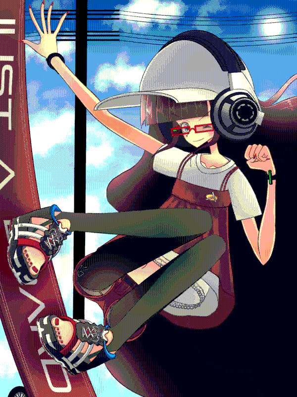
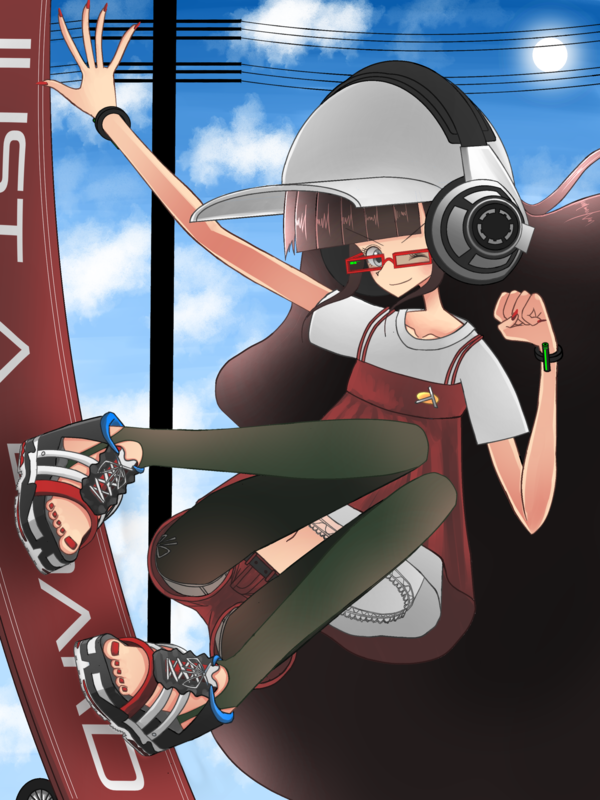
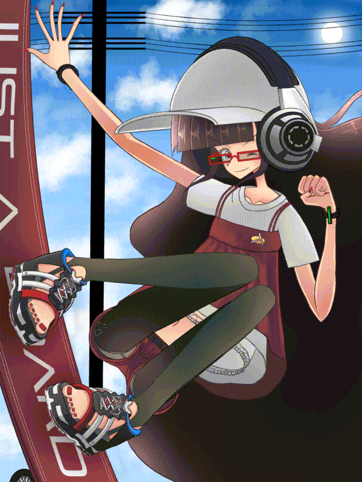
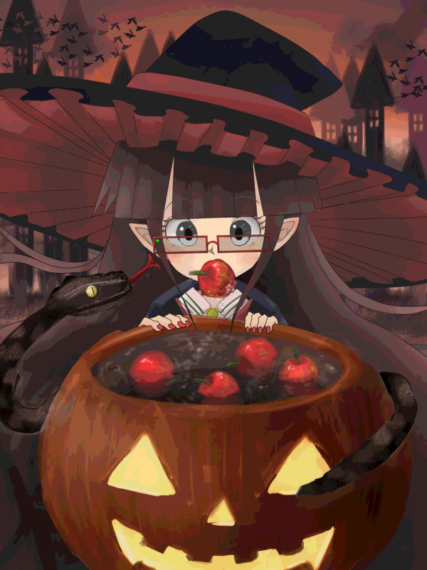
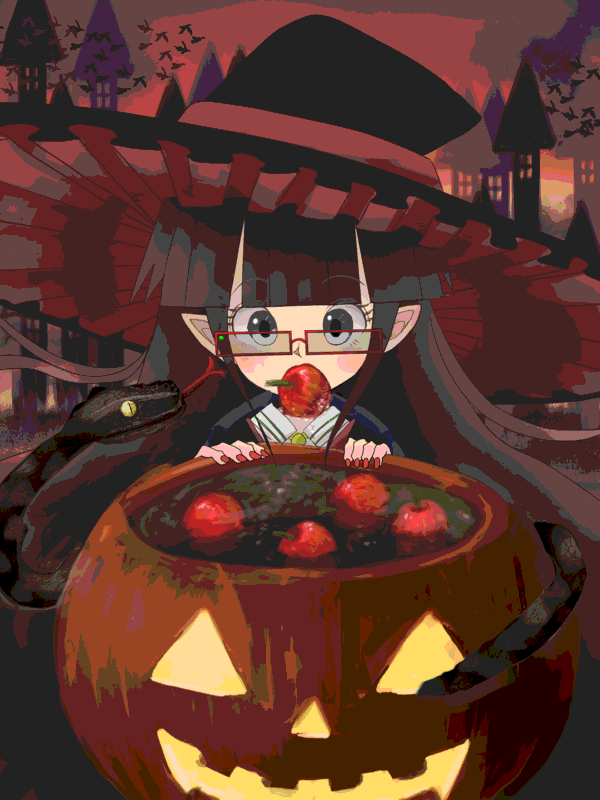
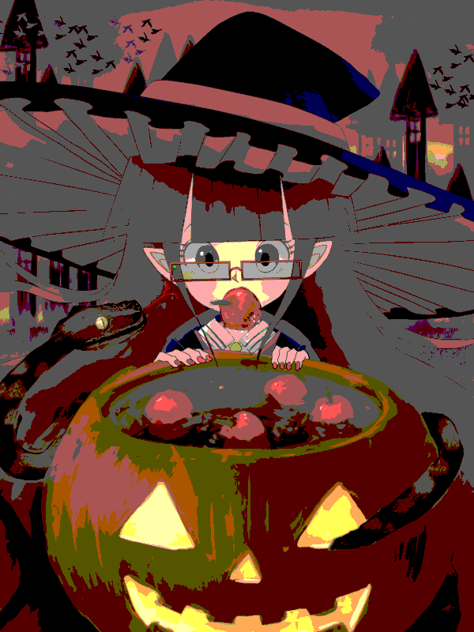
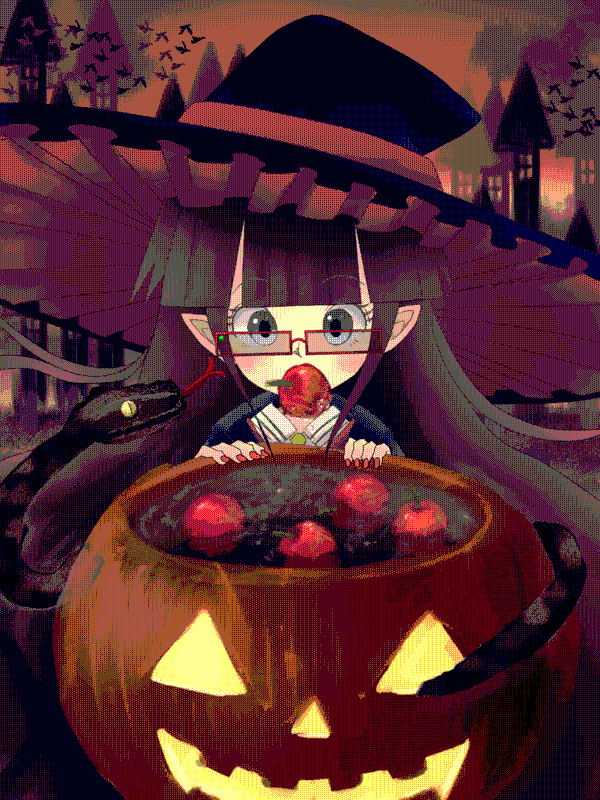

# 減色ツール pixelize

pixelize という減色ツールを開発したので紹介する。



## 概要

pixelize はグラデーション部分を網かけで表現することにより、イラストの品質を保ちつつ 8-bit color (R: 3-bit, G: 3-bit, B: 2-bit) にまで減色するツールである。

## 動機

ドット絵ゲームは現在でも人気の高いジャンルである。
しかしイラストは基本的になめらかなため、ドット絵ゲームにそのまま描画すると違和感があると感じるひともいる(例: わたし)。
そこでイラストをドット絵ゲームになじむような表現に変換したい。

## アイディア

ドット絵の特徴はいろいろあるが、もっとも重要な部分は色数だと思う。
つまり2<sup>8</sup>色や2<sup>15</sup>色で表現されていることが、ドット絵をドット絵たらしめているのではないか。
そこでイラストの品質を保ちつつ、できるだけ減色する方法を模索した。

## 素朴な方法

まず試したことは、 ImageMagick の `-depth n` などのオプションで減色する方法である。
まず、元画像 **just-a-board.png** を用意する。

**just-a-board.png** (482KB):



これを ImageMagick の `-depth n` オプションで減色する。
`n` は R/G/B のそれぞれのビット数なので、全体のビット数は (透明度がない場合) `n * 3` ビットとなる
(透明度がある場合、 `n * 4` ビット)。

```
convert -depth 5 just-a-board.png just-a-board/15bit.png
```

**just-a-board/15bit.png** (242KB):


```
convert -depth 4 just-a-board.png just-a-board/12bit.png
```

**just-a-board/12bit.png** (148KB):


```
convert -depth 3 just-a-board.png just-a-board/9bit.png
```

**just-a-board/9bit.png** (61KB):


```
convert -depth 2 just-a-board.png just-a-board/6bit.png
```

**just-a-board/6bit.png** (39KB):


ビット数が減るごとに、イラストの品質が落ちていることがわかると思う。

見てわかるように、グラデーション部分の色が階段関数的に減色されてしまっている。

ドット絵師がグラデーションを表現する場合、ただ単に階段関数的に減色するのではなく、 **網かけ** と呼ばれる方法で、限られた色を使って中間的な色を表現することがある。
`pixelize` は、その手法を参考にすることで 8bit でグラデーションを表現することを可能としている。

```
./pixelize just-a-board.png just-a-board/pixelized.png
```

**just-a-board/pixelized.png** (111KB):



8bit まで減色したにもかかわらず、もとのイラストの品質を保っていることがわかるだろうか。

さらに減色することも可能である。

**just-a-board/pixelized_6bit.png** (79KB):

```
convert -depth 2 just-a-board/pixelized.png just-a-board/pixelized_6bit.png
```


ここまで減色してしまうとさすがに若干品質が落ちてしまうが、元画像をそのまま `-depth 2` とするより、はるかに品質が高いことがわかっていただけると思う。

# その他の例

## apple-bobbing.png

**apple-bobbing.png**:


**apple-bobbing/15bit.png**:


**apple-bobbing/12bit.png**:



**apple-bobbing/9bit.png**:



**apple-bobbing/6bit.png**:



**apple-bobbing/pixelized.png**:


**apple-bobbing/pixelized_6bit.png**:


