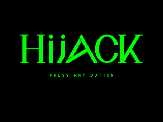
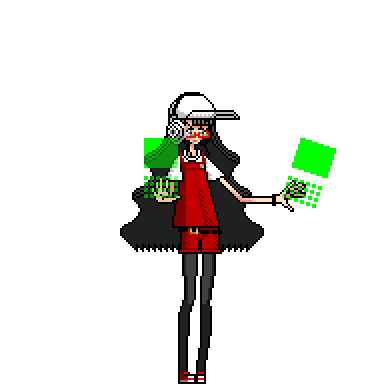

# Hijack 開発ブログ (2019年1月)

現在、趣味で [Hijack](https://bydriv.github.io/game/hijack/) というゲームを開発している。
それなりに進捗がでてきたし、宣伝も大事だと思うのでそれも兼ねてブログを書く。

## 開発の目的

まず、なぜ開発しているのかについてだけど……これは、完全に趣味としか言いようがない。
*Just For Fun* の精神である(ほんまか)。
すくなくともいまのところ、これを売って稼ぎたいとかはあまり考えてない。

ただひとつ目的はあり、世界観を表現したいというのがある。
表現が稚拙やんけ、みたいなのはあるけど、やらないと始まらないわけです。

## 技術的詳細

- **開発言語**: Rust
- **バイナリ形式**: exe, wasm

Rust で開発して、 exe と wasm にクロスコンパイルしてる。
Rust はクロスコンパイルが楽ですごい。

## ゲームシステム

敵は基本的にドローンで、主人公(テーリ)はドローンをハイジャックできる。
ハイジャックしたドローンで部隊を編成したり、戦闘をしたりできる……という感じ。

## 完成像

短篇集的な感じで、プレイ時間が数分程度のエピソードをいくつか用意する、という感じにしたい。
エピソードをクリア数に応じてつぎのエピソードが unlock される的な。

できればエピソードの数はたくさん用意したいけど、
あんまり最低これくらい用意するみたいなのを決めると完成しないことが容易に想像できるので、
ひとまずエピソードがひとつ用意できた時点で完成で、
あとはエピソード随時追加する的な感じで更新してゆきたい。

## ロードマップ

あんまり細かいことは決めてないし、決めてもそのとおりにはできない気がする。
ただ、先延ばしにする癖がつくと平気で1年どころか数年経ってるので、1日1日を大事にしてゆきたい。

できれば1月中にエピソードひとつつくりたいけど、正直難しい気もしてる。
3月中に最初のエピソードができれば御の字かな？という感じ。

最初のエピソードについては、ひとまず

- ドローンを全滅すればクリア
- エピソード開始時と、クリア時にちょっとしたストーリー (開始時: 街が暴走ドローンに襲われてる! どうにかしなきゃ!, クリア時: どうにか街を守れてよかったよかった、とかその程度のストーリー) をつける。

くらいで完成としていいんじゃないかなという感じがある。

## 去年との相違

去年のこの時期もそんなこと言ってませんでしたか？
ああ、うん、ね……。

まあ、去年はちょっとドット絵が大きすぎた感がある。
比較:

| old.gif             | new.gif             |
|---------------------|---------------------|
|  |  |

(見ればわかると思うけど) 左が去年のバージョンで、右が今年のバージョン。

去年のドット絵は、今年のドット絵に比べて縦横それぞれ6倍も大きく、面積にして36倍の作業量が必要だった。
まあそれでもテーリのドット絵はなんとか用意できたんだけどヴェリティとかエミリーとか、モブキャラも全員この大きさでやるのは不可能だな、と思って意気消沈していた。

要するに要件定義の段階で不可能な目標だった気がする。
今年はなんとか可能なとこまで目標を下方修正できた感じかな。
まあ、良い方向だと思う。
