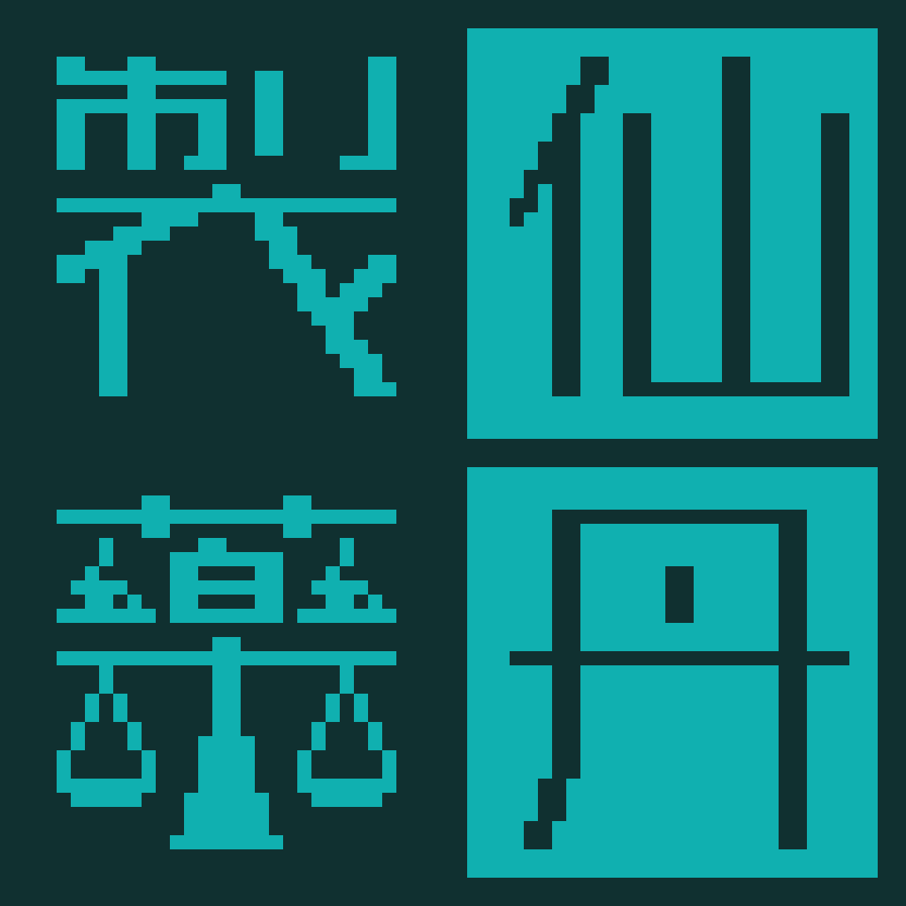

# 仙丹製薬

**仙丹製薬** (**繁体字**: 仙丹製藥, **簡体字**: 仙丹制药) は、台湾の製薬会社。

- **経営者**: イェ・シャオシュー
- **筆頭株主**: チェン・スーシュー

なにかと出番が多い企業。

- [セレクティヴ](/literature/selective)の主人公のノーラ・バウムガルテンは仙丹製薬の薬剤師だった。
- [黄金録](/literature/golden-record)では主人公のエミリー・リバーズが仙丹製薬の出資を受ける。
- [心の在処](/literature/rcs/pilot)では仙丹製薬で事件が起こり、
  主人公のレミリー・リバーズが捜査にあたる。
- [テーリの諜報日誌: ゼロ](/literature/agent-log/zero)ではテーリの就職先の候補のひとつだった。

## 税金

[黄金録](/literature/golden-record)のヴェリティの発言によれば「大陸での課税がすさまじい」らしい。
一方[セレクティヴ](/literature/selective)ではノーラが「仙丹製薬は中国の免税企業」と説明している。
セレクティヴの時代は黄金録のだいたい 30 年前なので、そのあいだになにか変化があったのかもしれない。

## 事業

製薬会社なので製薬が中心的な事業だが、世界企業になったため、いろいろな分野に進出している様子。

[黄金録](/literature/golden-record)ではルズベテルに新しい店舗を展開しており、
「ルズベテルの仙丹製薬はオフィスや病院も兼ねた店舗で、 1階から2階が薬局、3階から6階は仙丹製薬附属病院、 7階と8階がオフィスになってる」と説明されている。

小売店や病院も経営しているようだ。

## 所有施設

- 台湾本社 ([セレクティヴ](/literature/selective))
- ドイツ支社 ([セレクティヴ](/literature/selective))
- ロサンゼルス支店、ラスベガス支店 ([心の在処](/literature/rcs/pilot))
- ルズベテルの店舗 ([黄金録](/literature/golden-record))

## 仙丹

仙丹は同社の主力製品で、[黄金録](/literature/golden-record)での描写によれば、
「テロメアに作用して寿命を延ばす薬品」と説明されている。

- 効用は「1錠あたりおよそ8時間、細胞の老化を遅らせる」。
- 値段は1錠1000ドル。

らしい。

## マフィアとの癒着

仙丹製薬は香港マフィアと癒着しているらしい。
しかしあまりにも大きな企業になってしまい同社の経済的な重要度は非常に高いため、
そのことについて政府は黙認している現状の模様。
